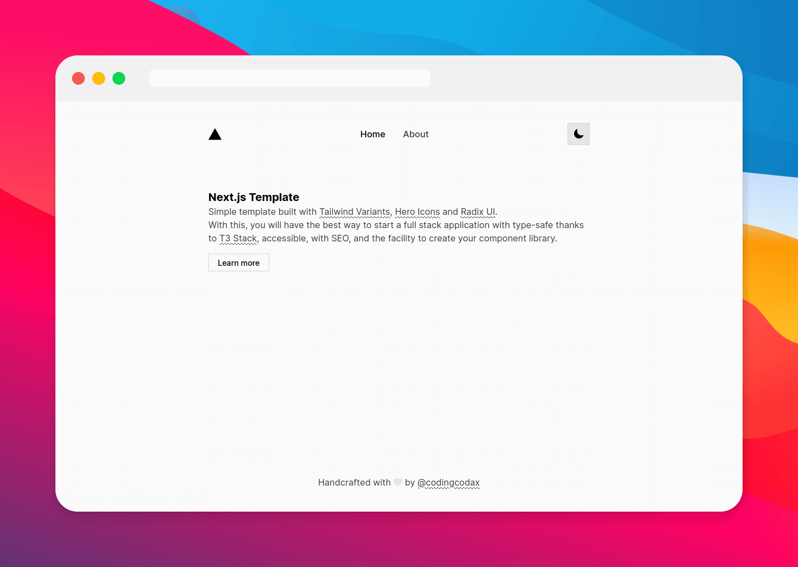
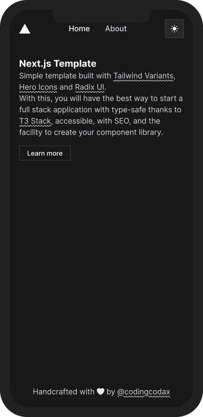
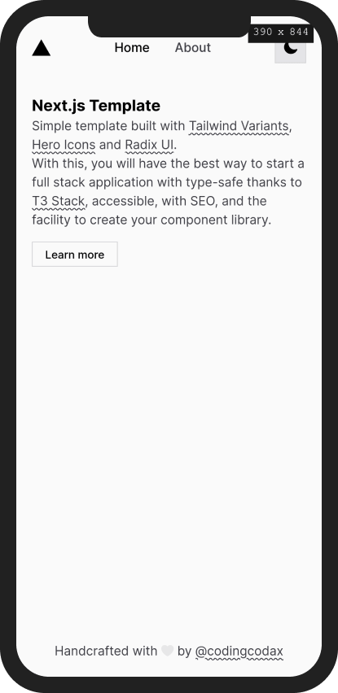

  

  <h3 align='center'>Next.js Template</h3>

  

    <samp>Simple template built with Tailwind Variants, Hero Icons and Radix UI.</samp>
     
    <a href='https://github.com/codingcodax/next-template/generate' rel='noopener noreferrer' target='_blank'><strong>Try it out!</strong></a>
     
     
    <a href='https://github.com/codingcodax/slug/next-template/'>Feature Request</a>
    ·
    <a href='https://github.com/codingcodax/next-template/issues/'>Bug Report</a>
  

## Features

- Tailwind CSS.
- Tailwind CSS and Radix UI with [`tailwindcss-radix`](https://github.com/ecklf/tailwindcss-radix)
- Dark mode with [`next-themes`](https://github.com/pacocoursey/next-themes)
- Icons from [Heroicons](https://heroicons.com/)
- Fonts with [`@next-font`](https://nextjs.org/docs/api-reference/next/font)
- Automatic import sorting with [`@ianvs/prettier-plugin-sort-imports`](https://github.com/IanVS/prettier-plugin-sort-imports)

## Tailwind CSS Features

- Class merging with [`taiwind-merge`](https://github.com/dcastil/tailwind-merge)
- Conditional classes with [`clsx`](https://github.com/lukeed/clsx)
- Variants with [`tailwind-variants`](https://www.tailwind-variants.org/)
- Automatic class sorting with [`eslint-plugin-tailwindcss`](https://github.com/francoismassart/eslint-plugin-tailwindcss)

### Techstack

This app was built with the T3 Stack:

- [Next.js](https://nextjs.org)
- [tRPC](https://trpc.io)
- [Tailwind CSS](https://tailwindcss.com)
- [TypeScript](https://typescriptlang.org)
- [Prisma](https://prisma.io)
- [NextAuth.js](https://next-auth.js.org)

## Gallery

### Desktop

  
Dark

  

  
Light

  

### Mobile

  
Dark

  

  
Light

  

## Set up

If you do not want some T3 stack function such as Prisma, tRPC or Next Auth follow these steps.

### Prisma

You have to remove:
- `~/prisma` directory
- `~/src/server/db.ts` file
- `DATABASE_URL` from `.env` lines 3 to 6 and from `env.mjs` lines 8 and 41

### tRPC

You have to remove:
- `~/src/pages/api/trpc` directory
- `~/src/server/api` directory

### Nexth Auth

You have to remove:
- `~/src/pages/api/auth` directory
- `~/src/server/auth.ts` file
- `NEXTAUTH_SECRET` from `.env` lines 7 to 12 and from `env.mjs` lines 10 to 13 and 43
- `NEXTAUTH_URL` from `.env` line 13 and from `env.mjs` lines 14 to 20 and 44
- `DISCORD_CLIENT_ID` from `.env` lines 14 to 16 and from `env.mjsj` lines 21, 22 and 45
- `DISCORD_CLIENT_SECRET` from `.env` line 17 and from `env.mjs` lines 23 and 46

## License

Licensed under the [MIT license](./LICENSE.md)
